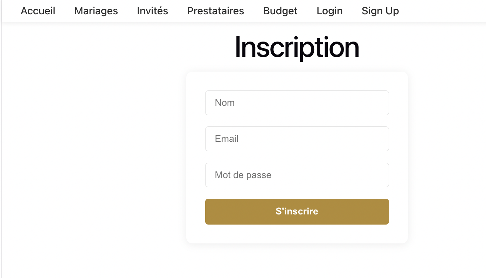

# Wedding Planner

Une application complète pour organiser un mariage : gestion des invités, du budget, des prestataires et des mariages.

## Fonctionnalités principales
- Authentification (inscription, connexion, déconnexion)
- Gestion des mariages (création, affichage)
- Gestion des invités
- Gestion des prestataires
- Gestion du budget

## Démarrage rapide

### Prérequis
- Node.js >= 18
- MongoDB (en local ou distant)

### Installation

Clone le dépôt puis installe les dépendances pour le front et le back :

```bash
cd wedding_planner
cd back
npm install
cd ../front
npm install
```

### Lancement du backend

Dans le dossier `back` :

```bash
npm start
```

Le serveur écoute par défaut sur http://localhost:8000

### Lancement du frontend

Dans le dossier `front` :

```bash
npm run dev
```

L’application sera accessible sur http://localhost:5173

## Captures d’écran

### Page de connexion


### Page d’inscription


### Navbar connectée


### Gestion des mariages


## Astuces
- Un token JWT est stocké dans le localStorage après connexion/inscription.
- Les routes protégées nécessitent d’être connecté.

## Auteur
Sterckx Joffrey

